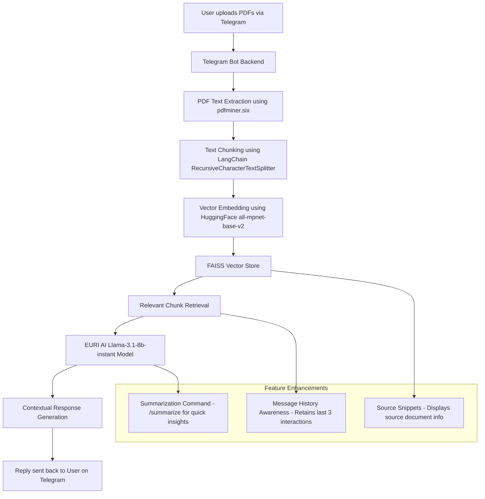

# 🧠 MediChat Pro – Telegram Bot

An intelligent **AI-powered Telegram bot** that allows users to upload and chat with their **medical PDF documents**.  
MediChat Pro automatically extracts, indexes, and analyzes uploaded medical reports — enabling contextual question answering using **Retrieval-Augmented Generation (RAG)**.

---

## ⚙️ Features

✅ Upload **multiple medical PDFs** (lab reports, prescriptions, summaries).  
✅ Automatically **processes documents** into searchable vector embeddings.  
✅ **Chat with your reports** — ask questions, and get context-aware medical insights.  
✅ **Message history awareness** — remembers your last 3 interactions for continuity.  
✅ **Source snippets** — clearly displays which PDF file the answer was derived from.  
✅ **/summarize command** — quickly summarizes your recent chat or uploaded medical documents.  
✅ Built using **LangChain**, **FAISS**, and **Llama 3.1 (8B)** for blazing-fast retrieval and intelligent responses.

---

## 🧠 Tech Stack

| Layer | Technology |
|--------|-------------|
| **Language Model (LLM)** | `Llama-3.1-8b-instant` (via EURI API) |
| **Embedding Model** | `sentence-transformers/all-mpnet-base-v2` |
| **Vector Store** | FAISS |
| **Frameworks** | LangChain, pdfminer.six, python-telegram-bot |
| **Runtime** | Python 3.10+ |
| **Environment** | `.env` for token and API key management |

---

## 🏗️ System Architecture



---

## ⚙️ Environment Setup

### 1️⃣ Clone the Repository
```bash
git clone https://github.com/yourusername/MediChat-Pro-Telegram-Bot.git
cd MediChat-Pro-Telegram-Bot
```

### 2️⃣ Create and Activate a Virtual Environment

#### 🪟 On Windows:
```bash
python -m venv avivo_task_telegram_bot
avivo_task_telegram_bot\Scripts\activate
```

#### 🐧 On Mac/Linux:
```bash
python3 -m venv avivo_task_telegram_bot
source avivo_task_telegram_bot/bin/activate
```

### 3️⃣ Install Dependencies
```bash
pip install -r requirements.txt
```

---

### 4️⃣ Configure Environment Variables

Create a `.env` file in the project root and add:
```bash
TELEGRAM_BOT_TOKEN=your_telegram_bot_token_here
EURI_API_KEY=your_euri_api_key_here
```

> 💡 Get your Telegram token from [@BotFather](https://t.me/BotFather)  
> 💡 Get your Euri API key from [https://euri.ai](https://euri.ai)

---

## 📦 Requirements

```txt
python-telegram-bot==20.7
python-dotenv==1.0.1
langchain==0.2.14
langchain-community==0.2.11
faiss-cpu==1.8.0
sentence-transformers==3.0.1
pdfminer.six==20221105
EuriAI==0.1.5
PyMuPDF==1.24.1
```

---

## 🚀 Running the Bot

```bash
python bot.py
```

Once started, open Telegram and chat with your bot.  
You should see:
```
🚀 MediChat Bot (enhanced) is running...
```

---

## 🧩 Commands Overview

| Command | Description |
|----------|-------------|
| `/start` | Initialize the bot and show welcome message. |
| `/process` | Process all uploaded PDFs into FAISS embeddings. |
| `/summarize` | Summarize the last 3 interactions or entire document content. |

---

## 🧠 How It Works

1. **PDF Extraction** → Extracts text using `pdfminer.six`.  
2. **Chunking** → Splits long text into small, overlapping chunks for better context retention.  
3. **Embeddings** → Converts text chunks into numerical vectors using Hugging Face `all-mpnet-base-v2`.  
4. **Vector Indexing** → Stores embeddings efficiently in a **FAISS vector store**.  
5. **Retrieval & Answering** → Matches user queries against the most relevant text chunks and generates contextual responses via **EURI AI’s Llama-3.1-8b-instant**.  
6. **Enhancements** →  
   - Maintains last 3 messages per user for context continuity.  
   - Displays which document contributed to each answer.  
   - Summarizes either chat history or document content using `/summarize`.

---

## 🔮 Future Enhancements

Planned upgrades and upcoming features for **MediChat Pro** include:

- 🖼️ **OCR Integration:** Extract text from image-based PDFs using Tesseract.  
- ☁️ **Cloud Vector Store:** Persist embeddings for multi-session, multi-user access.  
- 🗣️ **Voice-based Q&A:** Allow voice-based interactions in Telegram.  
- 🔐 **Enhanced Privacy Mode:** Automatically delete processed data after session expiry.  
- 📈 **Dashboard Extension (Web UI):** Visualize document insights and summaries.  
- ⚡ **Query Caching:** Avoid redundant re-embedding for repeated queries.  
- 🧾 **Export Summary:** Save generated summaries as downloadable PDFs.

---

## 👨‍💻 Author

**Nandha Kishore**  
📫 [LinkedIn](https://www.linkedin.com/in/nandha-kishore-b35ba61a0/)  
🧠 AI | Automation | Generative AI | Data Analytics  

---

