# 🧠 MediChat Pro – Telegram Bot

An intelligent **AI-powered Telegram bot** that allows users to upload and chat with their **medical PDF documents**.  
MediChat Pro automatically extracts, indexes, and analyzes uploaded medical reports — enabling contextual question answering using **Retrieval-Augmented Generation (RAG)**.

---

## ⚙️ Features

- 📂 Upload and process **one or more medical PDFs**
- 💬 Ask **natural language questions** about your documents
- ⚡ Uses **FAISS vector search** for context retrieval
- 🤖 Powered by **Euri AI’s large language model**
- 🔗 Built with **LangChain**, **Sentence Transformers**, and **python-telegram-bot**

---

## 🧩 Tech Stack

| Component | Library / Service |
|------------|------------------|
| **Bot Framework** | python-telegram-bot |
| **LLM** | llama-3.1-8b-instant (via Euri AI API) |
| **Embeddings** | sentence-transformers/all-mpnet-base-v2 (Hugging Face) |
| **Vector Store** | FAISS |
| **Pipeline Orchestrator** | LangChain |
| **PDF Parser** | pdfminer.six / PyMuPDF |

---

## 🏗️ Environment Setup

### 1. Clone the repository
```bash
git clone https://github.com/yourusername/MediChat-Pro-Telegram-Bot.git
cd MediChat-Pro-Telegram-Bot
```

### 2. Create and activate a virtual environment

#### 🪟 On Windows:
```bash
python -m venv avivo_task_telegram_bot
avivo_task_telegram_bot\Scripts\activate
```

#### 🐧 On Mac/Linux:
```bash
python3 -m venv avivo_task_telegram_bot
source avivo_task_telegram_bot/bin/activate
```

### 3. Install dependencies
```bash
pip install -r requirements.txt
```

If `requirements.txt` is not present yet, create it using the content below.

---

## 📦 requirements.txt

```txt
python-telegram-bot==20.7
python-dotenv==1.0.1
langchain==0.2.14
langchain-community==0.2.11
faiss-cpu==1.8.0
sentence-transformers==3.0.1
pdfminer.six==20221105
EuriAI==0.1.5
PyMuPDF==1.24.1
```

---

### 4. Configure Environment Variables

Create a `.env` file in the root directory with the following:

```bash
TELEGRAM_BOT_TOKEN=your_telegram_bot_token_here
EURI_API_KEY=your_euri_api_key_here
```

> 💡 **Note:**  
> Get your Telegram token from [@BotFather](https://t.me/BotFather)  
> Get your Euri API key from [https://euri.ai](https://euri.ai)

---

### 5. Project Structure

```
MediChat-Pro-Telegram-Bot/
│
├── bot.py                     # Main Telegram bot logic
├── chat_utils.py              # Handles chat model interaction
├── vectorstore_utils.py       # FAISS embedding & retrieval logic
├── requirements.txt
├── .env                       # API credentials
└── data/                      # Stores FAISS index and PDFs
```

---

## 🚀 Running the Bot

Once setup is complete, run the bot:

```bash
python bot.py
```

You should see:
```
🚀 MediChat Bot is running...
```

Then open Telegram → search for your bot → upload your medical PDF(s) → and start chatting.

---

## 🩺 Example User Flow

1. **Upload PDF(s)** – “CBC_Report.pdf” 
2. Bot →  
   - “📄 Received: CBC_Report.pdf” 
   - “⚙️ Processing your medical documents...” 
   - “✅ Documents processed successfully! You can now ask your questions.” 
3. User → “What are the test results for hemoglobin?” 
4. Bot → “The hemoglobin level recorded in the report is 13.5 g/dL, which is within the normal range.”

---

## 🧠 How It Works

1. **PDF Extraction** → Extracts text using `pdfminer` or `PyMuPDF`.
2. **Chunking** → Splits long text into manageable pieces using `RecursiveCharacterTextSplitter`.
3. **Embedding** → Converts chunks into vector embeddings with `SentenceTransformers`.
4. **Vector Indexing** → Stores embeddings in **FAISS** for efficient similarity search.
5. **Question Answering** → Retrieves top matches and queries the **Euri AI model** to generate a contextual response.

---

## 🏗️ System Architecture

```mermaid

flowchart TD
    A[📤 User Uploads PDFs via Telegram] --> B[🤖 Telegram Bot Backend]
    B --> C[📄 PDF Text Extraction using pdfminer.six]
    C --> D[🧩 Text Chunking using RecursiveCharacterTextSplitter]
    D --> E[🔡 Vector Embedding with HuggingFace all-mpnet-base-v2]
    E --> F[📚 FAISS Vector Store]
    F --> G[🔍 Relevant Chunk Retrieval]
    G --> H[🧠 EURI AI Llama 3.1 8B Model]
    H --> I[💬 Contextual Response Generation]
    I --> J[📲 Telegram Chat Reply to User]
```



## 🔮 Future Enhancements

Planned upgrades and upcoming features for **MediChat Pro** include:

- 🖼️ **OCR Integration:** Enable text extraction from image-based PDFs using Tesseract.  
- 🧠 **Multi-format Support:** Allow users to upload and process `.docx`, `.xlsx`, and `.txt` files in addition to PDFs.  
- 📊 **Structured Data Insights:** Automatically extract and summarize key medical metrics and trends from reports.  
- ☁️ **Cloud Vector Store:** Persist document embeddings securely for multi-session and multi-user access.  
- 🗣️ **Voice-based Q&A:** Introduce voice interaction for asking questions through Telegram voice messages.  
- 🤝 **Multi-user Context Management:** Support simultaneous sessions and maintain separate document contexts per user.  
- 🔐 **Enhanced Privacy Mode:** Automatically delete processed files and vectors after session expiry.  
- 📈 **Dashboard Extension (Web UI):** Develop a simple web interface to visualize summaries and extracted insights.  
- 💬 **Message History Awareness:** Maintain the last 3 user interactions for improved contextual continuity.  
- ⚡ **Caching:** Avoid re-embedding queries that have been processed before for faster responses.  
- 📎 **Source Snippets:** Display which document or section contributed to each RAG-based answer.  
- 🧾 **/summarize Command:** Summarize the last uploaded PDF or recent chat context directly within Telegram.


---

## 👨‍💻 Author
**Nandha Kishore**  
📫 [LinkedIn](https://www.linkedin.com/in/nandha-kishore-b35ba61a0/)
